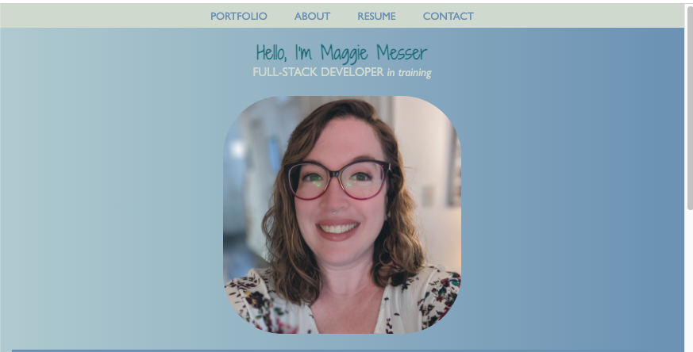
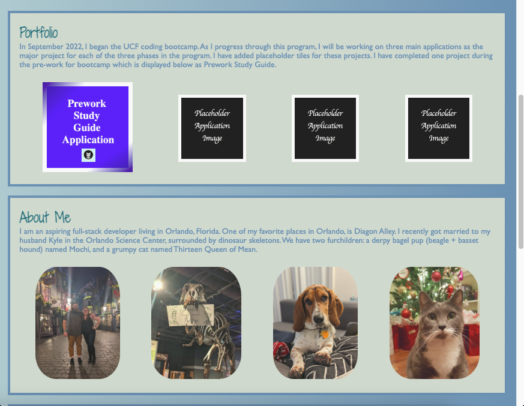
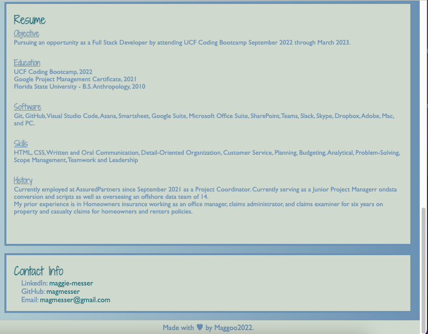

# Portfolio Project

## User Story

>AS AN employer  
I WANT to view a potential employee's deployed portfolio of work samples  
SO THAT I can review samples of their work and assess whether they're a good candidate for an open position

## Description

This project tested the knowledge of HTML and CSS learned in the course thusfar.  By starting from scratch and without starter code, it allowed me to develop my research skills and demonstrate how much I have learned thusfar.  I was surprised by how much I knew.  What I didn't know, I was able to determine by referencing in class notes and activities, as well as many Google Searches. 

---

## Links

- Click the link below to access the deployed site on GitHub Pages. 
https://magmesser.github.io/portfolio/

- Click the link below to access to application repository on GitHub.  
https://github.com/magmesser/portfolio

---

## Screenshot

The following images are screenshots of the web application's appearance: 

